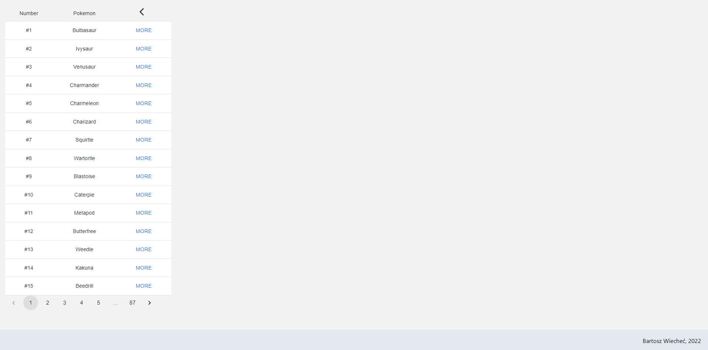
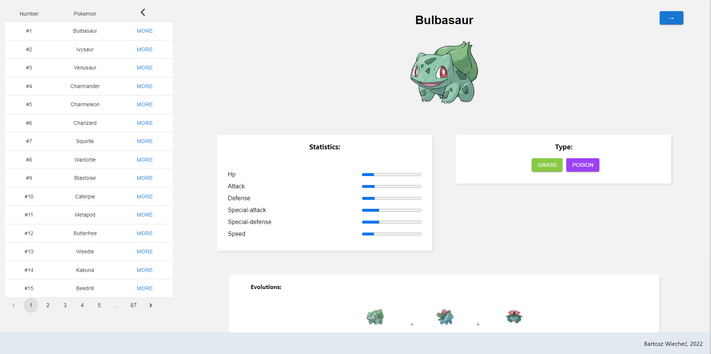

# PokedexApp

## Description

This project is one of my first React apps. It's made using PokeApi `https://pokeapi.co/`.
It uses React and two of it's libraries MUI and React-Router.

## Table of Contents

- [Technologies](#technologies)
- [Installation](#installation)
- [Usage](#usage)
- [Features](#features)

## Technologies

- React
  - Material UI
  - React Router

## Installation

Requirements:

- Node.js
- Yarn

To install project dependencies use

```
yarn install
```

To run app use

```
yarn run start
```

## Usage

| 1. View after App is loaded  | 2. View after Pokemon is chosen  |
| ------------------------------------------------------------------------- | -------------------------------------------------------------------------------- |
